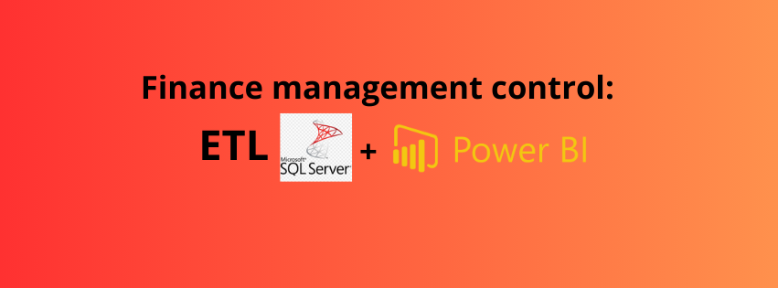
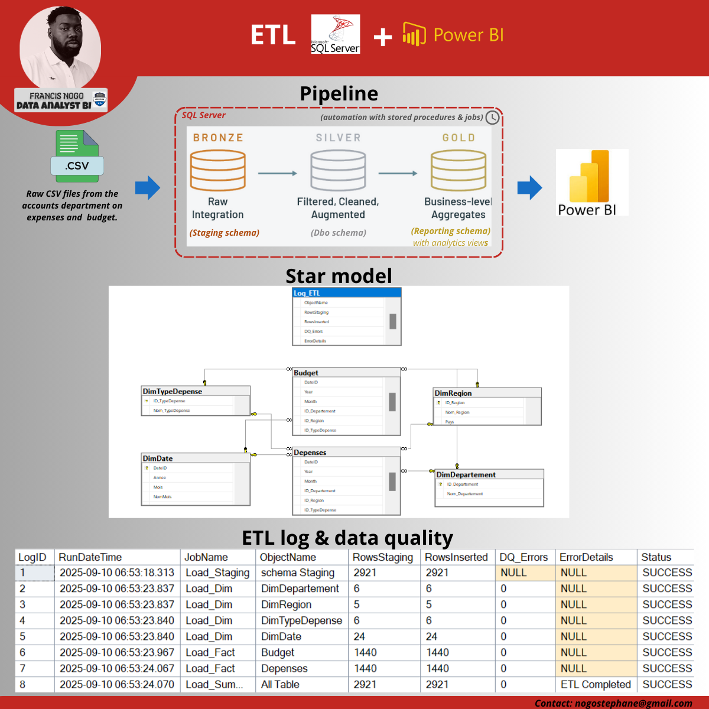
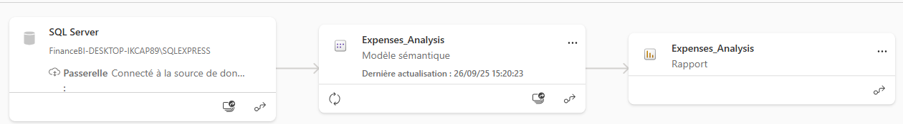
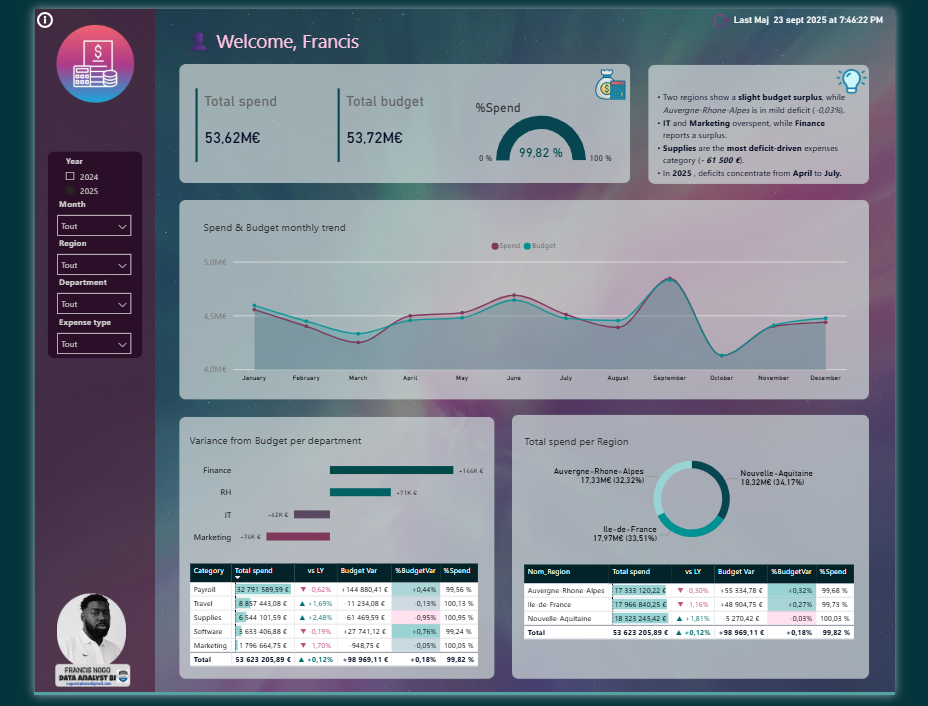

<!-- Banner -->

  

# 🚀 Expense Analysis & Data Quality Project (SQL Server & Power BI)

## 📌 Overview
This project demonstrates the implementation of a **mini data warehouse for management control**, built on **SQL Server** and visualized with **Power BI**.  
It highlights **ETL automation, Data Quality integration, layered architecture (Bronze / Silver / Gold)**, and professional BI best practices.  

---

## 🏗️ Project Architecture

- **Bronze (staging)** → Raw data imported from CSV files.  
- **Silver (dbo)** → Cleaned, standardized, and enriched data with built-in Data Quality rules.  
- **Gold (reporting)** → Analytical views ready for Power BI (Budget vs Actual, Monthly trends, Top N, etc.).  

  

  

---

## 🔎 Key Features

✅ **Automated ETL with stored procedures** (Bulk Insert + Transformation)  
✅ **Data Quality embedded** during staging → dbo load  
✅ **ETL Logging** via `Log_ETL` table (execution time, rows loaded, errors)  
✅ **Star schema** for optimized reporting  
✅ **Interactive Power BI dashboard** for business analysis  

---

## 📊 Dashboard Example

Built on the **Gold (reporting) layer**, the dashboard provides key insights on budget vs actuals, monthly spending, and departmental performance.  

  

---

## ⚙️ Tech Stack

- **SQL Server Express** (staging, dbo, reporting schemas)  
- **T-SQL** (stored procedures, views, Data Quality)  
- **Power BI Desktop** (interactive reports)  
- **GitHub** (version control & portfolio) 

⚠️ Disclaimer :
All datasets used in this project are synthetic and fictitious, created for educational and demonstrative purposes (management control, budget vs expenses).

👤 Author :
Developed by FRANCIS NOGO – Data Analyst | BI Consultant

